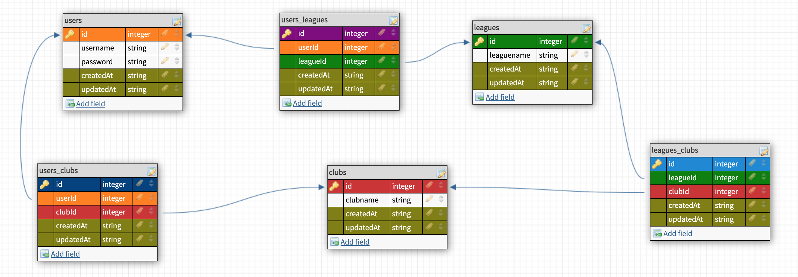
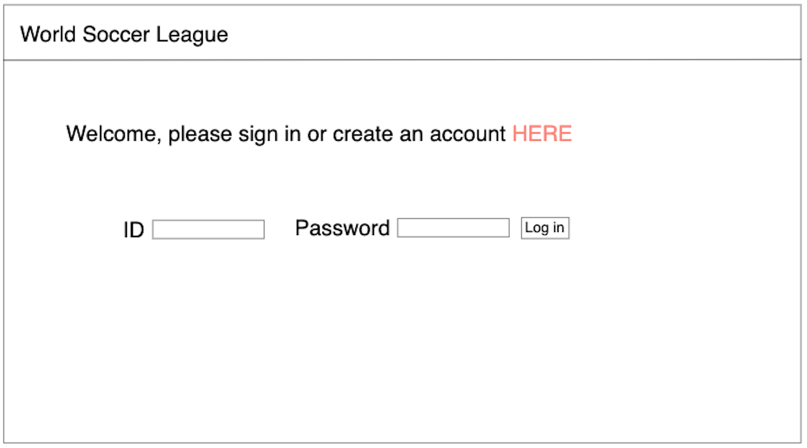
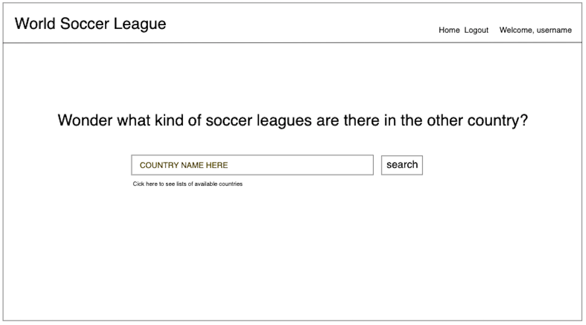
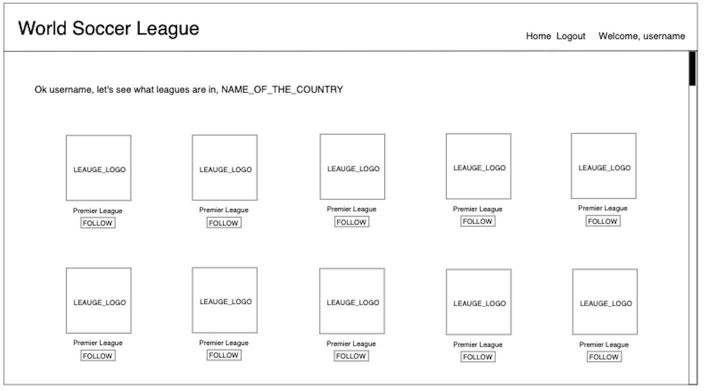

# World Soccer League

## Overview
- If you love soccer, you may wonder what kind of leagues are out there in every single country. Soccer Lover helps you to search and see the entire list of the league by each country.

## MVP Goals
- Research an API to see if it includes the information I want to use.
- Have a user create an account on the first page and log out functionality
- If a user attempts to search a specific country, lists all of the leagues.
- A user can see the lists of the players of the league

## User Stories
- A user needs to create an account to get access to Soccer Lover.
- A user will type the name of the country to see a list of the leagues.
- A user can save the club as a favorite club.
- A user can save the player as a favorite player.

## Stretch Goals
- A user is able to deactivate/delete an account

## Daily Sprints
- Monday
    - Test API
    - Wireframe app (using https://awwapp.com)
    - draw an ERDs
    - CRUDs, planning routes.
    - start working on the mainpage (Create an account/store the email, username and password to db)
- Tuesday
    - Store all clubs name(from API) into database
    - Finish the login and logout functionality
    - Finish country search input functionality
    - Style the main and search page
- Wednesday/Thursday
    - Create views
    - start CRUDs
    - Start MVP
- Friday
    - MVP
- Saturday
    - Finish MVP
    - If no bugs/issue, style the pages
    - (Stretch goals)
- Sunday
    - Fix the bugs/issue
    - style the stretch goals

## ERDs

## The Soccer Lover will look like this...

## CRUDs
- Create/POST
    - user account (username, password)
- Read/GET
    - main index page
    - account create page
    - favorite clubs page
    - lists of the leagues page 
    - players of the club page
- Update/PUT
    - a user can update their username
- Delete/DELETE
    - remove club from the favorite lists
    - completely remove user account from the database

